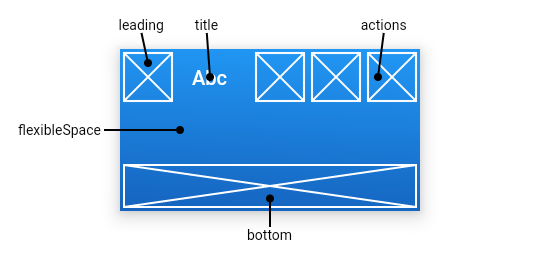

# 基础组件

## **1. Container 组件**

_**说明**_： 由于 `Container` 组合了许多其他小部件，每个小部件都具有自己的布局行为，因此 `Container` 的布局行为有些复杂。

_**介绍**_： `Container` 是一个组合类容器，它是由常见的 `绘画`，`定位` 和 `尺寸调整` 等相关组件所组成的一个多功能容器，所以我们只需通过一个 `Container` 组件可以实现同时需要 `装饰`、`变换`、`限制` 的场景。

_**注意**_：

* 容器的大小可以通过 `width`、`height` 属性来指定，也可以通过`constraints` 来指定；如果它们同时存在时，`width`、`height` 优先。实际上 `Container` 内部会根据 `width`、`height` 来生成一个 `constraints`。
* `color` 和 `decoration` 是互斥的，如果同时设置它们则会报错！实际上，当指定 `color` 时，`Container` 内会自动创建一个 `decoration`。

_**属性**_：

```dart
const Container({
    Key key; // 类似于 react 中的 key
    AlignmentGeometry alignment; // 对齐方式
    EdgeInsetsGeometry padding; // 容器内补白，属于decoration的装饰范围
    Color color; // 背景色
    Decoration decoration; // 背景装饰
    Decoration foregroundDecoration; // 前景装饰
    double width; // 容器的宽度
    double height; // 容器的高度
    BoxConstraints constraints; // 容器大小的限制条件
    EdgeInsetsGeometry margin; // 容器外补白，不属于decoration 的装饰范围
    Matrix4 transform; // 变换
    Widget child; // 子组件
})
```

_**例子**_：

```dart
/// 此示例显示了一个 48x48 的琥珀色正方形，放置在 Center 组件内，以免造成其它影响
Center(
  child: Container(
    margin: const EdgeInsets.all(10.0),
    color: Colors.amber[600],
    width: 48.0,
    height: 48.0,
  ),
)

/// 展示了 Container 的一些功能，显示的是一个旋转的矩形，矩形的中心是一个 Hello World
Container(
  constraints: BoxConstraints.expand(
    height: Theme.of(context).textTheme.display1.fontSize * 1.1 + 200.0,
  ),
  padding: const EdgeInsets.all(8.0),
  color: Colors.blue[600],
  alignment: Alignment.center,
  child: Text('Hello World',
    style: Theme.of(context)
        .textTheme
        .display1
        .copyWith(color: Colors.white)),
  transform: Matrix4.rotationZ(0.1),
)
```

## **2. Row 组件**

_**说明**_： 其设计是基于 `web` 开发中的 `Flexbox` 布局模型。

_**介绍**_：`Row` 可以在水平方向排列其子 `widget`。

* 如果想要将子项自适应所剩余的空间，则需要包装在 `Expanded  组件` 中（类似于 `css 弹性盒模型`）。`Row` 组件不会滚动，如果想要滚动，请使用 `ListView 组件`。

_**属性**_：

```dart
const Row({
    // 类似 React 组件中的 key
    Key key;
    // 如何将子项放在主轴上，默认为行的左侧或列的顶部
    MainAxisAlignment mainAxisAlignment = MainAxisAlignment.start;   
    // 主轴占用的空间，默认为最大
    MainAxisSize mainAxisSize = MainAxisSize.max;    
    // 十字轴上的排列方式
    CrossAxisAlignment crossAxisAlignment = CrossAxisAlignment.center;
    // 用作主轴的方向
    TextDirection textDirection;
    // 垂直放置的顺序
    VerticalDirection verticalDirection = VerticalDirection.down;
    // 对其哪个基线
    TextBaseline textBaseline;
    // 子部件
    List<Widget> children = const <Widget>[];    
})
```

_**例子**_：

```dart
/// 此示例将可用空间划分为三个（水平），并将文本放在前两个单元格中心，将Flutter徽标放在第三个中心：
Row(
  children: <Widget>[
    Expanded(
      child: Text('Deliver features faster', textAlign: TextAlign.center),
    ),
    Expanded(
      child: Text('Craft beautiful UIs', textAlign: TextAlign.center),
    ),
    Expanded(
      child: FittedBox(
        fit: BoxFit.contain, // otherwise the logo will be tiny
        child: const FlutterLogo(),
      ),
    ),
  ],
)
```

## 3. Column 组件

_**说明**_： 其设计是基于 `web` 开发中的 `Flexbox` 布局模型。

_**介绍**_：`Column` 可以在垂直方向排列其子 `widget`。

* 如果想要将子项自适应所剩余的空间，则需要包装在 `Expanded  组件` 中（类似于 `css 弹性盒模型`）。`Column` 组件不会滚动，如果想要滚动，请使用 `ListView 组件`。

_**属性**_：

```dart
const Column({
    // 类似 React 组件中的 key
    Key key;
    // 如何将子项放在主轴上，默认为行的左侧或列的顶部
    MainAxisAlignment mainAxisAlignment = MainAxisAlignment.start;   
    // 主轴占用的空间，默认为最大
    MainAxisSize mainAxisSize = MainAxisSize.max;    
    // 十字轴上的排列方式
    CrossAxisAlignment crossAxisAlignment = CrossAxisAlignment.center;
    // 用作主轴的方向
    TextDirection textDirection;
    // 垂直放置的顺序
    VerticalDirection verticalDirection = VerticalDirection.down;
    // 对其哪个基线
    TextBaseline textBaseline;
    // 子部件
    List<Widget> children = const <Widget>[];    
})
```

_**例子**_：

```dart
/// 此示例使用Column垂直排列三个小部件，最后一个小部件用于填充所有剩余空间。
Column(
  children: <Widget>[
    Text('Deliver features faster'),
    Text('Craft beautiful UIs'),
    Expanded(
      child: FittedBox(
        fit: BoxFit.contain, // otherwise the logo will be tiny
        child: const FlutterLogo(),
      ),
    ),
  ],
)
```

## 4. Image 组件

_**说明**_：创建图片的组件

_**介绍**_：

* 支持以下图像格式：`JPEG`，`PNG`，`GIF`，`GIF`，`WebP`，`BMP` 和 `WBMP`。
* 提供了几种可用于指定图像的方法的构造函数：
  * `new Image`，用于从 `ImageProvider` 获得图像。
  * `new Image.asset`，用于从 `资源目录` 显示图片。
  * `new Image.network`，用于从 `URL` 获取图像（获取网路图片）。
  * `new Image.file`，用于从 `File` 获取图像。
  * `new Image.memory`，用于从 `Uint8List（内存）` 获取图像。

```dart
// 资源图片
new Image.asset('imgs/logo.jpeg'),
//网络图片
new Image.network(
    'https://flutter.io/images/homepage/header-illustration.png'),
// 本地文件图片
new Image.file(new File("/Users/gs/Downloads/1.jpeg")),
// Uint8List 图片
new Image.memory(bytes),
//使用 ImageProvider 加载图片
new Image(image: new NetworkImage("https://flutter.io/images/homepage/screenshot-2.png"))
```

_**属性**_：

```dart
const Image({
  // 类似 react 组件中的 key
  Key key; 
  // 要显示的图像。
  ImageProvider<dynamic> image;
  // 负责创建代表该图像的窗口小部件
  Widget Function(BuildContext, Widget, int, bool) frameBuilder;
  // 用于指定图像仍在加载时向用户显示的小部件
  Widget Function(BuildContext, Widget, ImageChunkEvent) loadingBuilder;
  // 图像的语义描述，用于向Andoid上的TalkBack和iOS上的VoiceOver提供图像描述。(talkback是一款由谷歌官方开发的系统软件,它的定位是帮助盲人或者视力有障碍的用户提供语言辅助；Voiceover功能是APPLE公司在2009年4月新推出的一种语音辅助程序。)
  String semanticLabel; 
  // 是否启用图像的语义描述
  bool excludeFromSemantics = false; 
  // 图片的宽
  double width; 
  // 图片的宽
  double height; 
  // 图片的混合色值
  Color color; 
  // 如果为非 null，则使用 colorBlendMode 将此颜色与每个图像像素混合
  BlendMode colorBlendMode;
  // 图片的混合色值
  BoxFit fit; 
  // 对其方式，默认为居中
  AlignmentGeometry alignment = Alignment.center;
  // 重复方式，默认不重复
  ImageRepeat repeat = ImageRepeat.noRepeat; 
  // 九片图像的中心切片
  Rect centerSlice;
  // 是否在 TextDirection 的方向上绘制图像，默认为 false。if true，那么在TextDirection.ltr 上下文中，将在左上角绘制图像（图像的“正常”绘制方向）; 在 TextDirection.rtl 上下文中，图像将在水平方向上以缩放因子 -1 绘制，以便原点位于右上角
  bool matchTextDirection = false;
  // 当图像提供者发生变化时，是继续显示旧图像，默认不显示
  bool gaplessPlayback = false;  
  // 图像过滤器的质量级别。(渲染模式的质量)
  FilterQuality filterQuality = FilterQuality.low;
})
```

_**例子**_：

```dart
/// 默认构造函数可以与任何 ImageProvider 一起使用，例如 NetworkImage，以显示来自互联网的图像。
const Image(
  image: NetworkImage('https://flutter.github.io/assets-for-api-docs/assets/widgets/owl.jpg'),
)

/// 在此示例中，使用 Image.network 构造函数显示来自Internet的图像。
Image.network('https://flutter.github.io/assets-for-api-docs/assets/widgets/owl-2.jpg')
```

## 5. Text 组件（类似于 &lt;p&gt;）

_**说明**_：该 `widget` 可让创建一个带格式的文本。

_**介绍**_：`Text 组件` 显示一个样式单一的文本字符串。根据布局约束，字符串可能跨多行显示，也可能全部显示在同一行上。

_**属性**_：

```dart
const Text(
    String data; // 要显示的文本
    {
        Key key; // 类似于 react 组件中的 key 
        TextStyle style； // 文本样式
        StrutStyle strutStyle; // 支撑样式
        TextAlign textAlign; // 对齐方式
        TextDirection textDirection; // 文本显示的方向
        Locale locale; // 设置语言环境，就是国际化，多语言支持
        bool softWrap; // 文本是否应该在换行符处断行 
        TextOverflow overflow; // 用来处理文本溢出
        double textScaleFactor; // 每个逻辑像素的字体像素值
        int maxLines; // 显示文本的最大行数
        String semanticsLabel; // 该文本的另一种语义标签
        TextWidthBasis textWidthBasis; // 设置空值
    }
)
```

_**例子**_：

```dart
/// 这个例子展示了如何使用文本小部件显示文本。如果文本溢出，则使用省略号截断文本。
Text(
    'Hello, $_name! How are you?',
    textAlign: TextAlign.center,
    overflow: TextOverflow.ellipsis,
    style: TextStyle(fontWeight: FontWeight.bold),
)
```

### _**5.1 TextSpan组件（类似于 &lt;span&gt;）**_

_**说明**_：类似于 `html` 中的 `span`，将文字放在一行。

_**介绍**_：`TextSpan` 需要套一层 `Text.rich`，可以有 `children`，`children` 同为 `TextSpan`，可以分别加不同的样式，这里只能加样式，不可以加其他的属性。

_**属性**_：

```dart
const TextSpan({
    String text; // 要显示的内容
    List children; // 子部件，同为 TextSpan
    TextStyle style; // 要应用于此范围内的 TextStyle 样式
    GestureRecognizer recognizer; // 一个手势识别器，它将接收达到此范围的事件。
    String semanticsLabel; // 此 TextSpan 的替代语义标签
})
```

_**例子**_：

```dart
/// 使用 Text.rich 构造函数，文本小部件可以显示具有不同样式 textspan 的段落。下面的示例为每个单词显示不同样式的“Hello beautiful world”。
const Text.rich(
 TextSpan(
   text: 'Hello', // default text style
   children: <TextSpan>[
     TextSpan(text: ' beautiful ', style: TextStyle(fontStyle: FontStyle.italic)),
     TextSpan(text: 'world', style: TextStyle(fontWeight: FontWeight.bold)),
   ],
 ),
)
```

## 6. Icon 组件

_**说明**_：`Icon` 通常是由 `WidgetsApp` 或 `MaterialApp` 自动引入的。

_**介绍**_：`Flutter` 中，可以像 `Web` 开发一样使用 `iconfont`，`iconfont` 即“字体图标”，它是将图标做成字体文件，然后通过指定不同的字符而显示不同的图片。

_**优点**_：

> 在 `Flutter` 开发中，`iconfont` 和 `图片` 相比有如下优势：

* _**体积小**_：可以减小安装包大小。
* _**矢量的**_：`iconfont` 都是矢量图标，放大不会影响其清晰度。
* _**可以应用文本样式**_：可以像文本一样改变字体图标的颜色、大小对齐等。
* _**可以通过 `TextSpan` 和 `文本` 混用**_。

_**属性**_：

```dart
const Icon(
  IconData icon; // 显示的图标。图标可以为 null，在这种情况下，组件将呈现为指定大小的空白区域。
  {
    Key key; // 类似 react 组件中的 key 
    double size; // 图标的大小，以逻辑像素为单位。
    Color color; // 绘制图标时使用的颜色。
    String semanticLabel; // 图标的语义标签。
    TextDirection textDirection; // 用于呈现图标的文本方向。
  }
)
```

_**例子**_：

```dart
/// 本示例说明如何创建不同颜色和大小的 Icon。
Row(
  mainAxisAlignment: MainAxisAlignment.spaceAround,
  children: const <Widget>[
    Icon(
      Icons.favorite,
      color: Colors.pink,
      size: 24.0,
      semanticLabel: 'Text to announce in accessibility modes',
    ),
    Icon(
      Icons.audiotrack,
      color: Colors.green,
      size: 30.0,
    ),
    Icon(
      Icons.beach_access,
      color: Colors.blue,
      size: 36.0,
    ),
  ],
)
```

## 7. RaisedButton 组件

_**说明**_：`Material Design` 中的 `button`， 一个凸起的材质矩形按钮。

_**介绍**_：`RaisedButton` 基于 `Material Design`， 当按下该按钮时，其 `Material.elevation（相对于其父项放置此按钮的z坐标。）` 会增加。

_**属性**_：

```dart
const RaisedButton({
  // 类似于 react 组件中的 key
  Key key; 
  // 轻击或激活按钮时调用的回调。如果将其设置为 null，则该按钮将被禁用。
  void Function() onPressed; 
  // 水波纹高亮变化回调
  void Function(bool) onHighlightChanged; 
  // 定义按钮的基本颜色，以及按钮的最小尺寸，内部填充和形状的默认值。默认为 ButtonTheme.of(context).textTheme。
  ButtonTextTheme textTheme; 
  // 用于此按钮的文字颜色。
  Color textColor; 
  // 按钮被禁用时的文字颜色。
  Color disabledTextColor; 
  // 按钮的颜色。
  Color color; 
  // 按钮被禁用时的颜色  
  Color disabledColor; 
  // 当按钮具有输入焦点时的颜色。
  Color focusColor; 
  // 当指针悬停在按钮上时的颜色。
  Color hoverColor; 
  // 按钮的水波纹亮起的颜色
  Color highlightColor; 
  // 水波纹的颜色
  Color splashColor; 
  // 按钮主题高亮
  Brightness colorBrightness; 
  // 按钮下面的阴影长度
  double elevation; 
  // 启用按钮并具有输入焦点时，按钮下面的阴影长度。
  double focusElevation; 
  // 启用按钮且指针悬停在其上方时，按钮下面的阴影长度。
  double hoverElevation; 
  // 按钮高亮时的下面的阴影长度
  double highlightElevation; 
  // 未启用按钮时，按钮下面的阴影长度。
  double disabledElevation; 
  // 按钮内部的 padding
  EdgeInsetsGeometry padding; 
  // 按钮的形状
  ShapeBorder shape; 
  // 根据此选项，内容将被裁剪（或不裁剪）。
  Clip clipBehavior; 
  // 一个可选的焦点节点，用作此组件的焦点节点。
  FocusNode focusNode; 
  // 如果当前未将其范围内的其他节点作为焦点，则将此组件选择为初始焦点时为True。
  bool autofocus = false; 
  // 配置点击目标的最小大小。
  MaterialTapTargetSize materialTapTargetSize; 
  // 定义动画的持续时间。
  Duration animationDuration; 
  // 子组件
  Widget child;
})
```

_**例子**_：

```dart
/// 此示例演示如何渲染具有禁用背景的 RaisedButton，已启用的RaisedButton 和 最后一个带有渐变背景的 RaisedButton。
Widget build(BuildContext context) {
  return Center(
    child: Column(
      mainAxisSize: MainAxisSize.min,
      children: <Widget>[
        const RaisedButton(
          onPressed: null,
          child: Text(
            'Disabled Button',
            style: TextStyle(fontSize: 20)
          ),
        ),
        const SizedBox(height: 30),
        RaisedButton(
          onPressed: () {},
          child: const Text(
            'Enabled Button',
            style: TextStyle(fontSize: 20)
          ),
        ),
        const SizedBox(height: 30),
        RaisedButton(
          onPressed: () {},
          textColor: Colors.white,
          padding: const EdgeInsets.all(0.0),
          child: Container(
            decoration: const BoxDecoration(
              gradient: LinearGradient(
                colors: <Color>[
                  Color(0xFF0D47A1),
                  Color(0xFF1976D2),
                  Color(0xFF42A5F5),
                ],
              ),
            ),
            padding: const EdgeInsets.all(10.0),
            child: const Text(
              'Gradient Button',
              style: TextStyle(fontSize: 20)
            ),
          ),
        ),
      ],
    ),
  );
}
```

## 8. Scaffold 组件

_**说明**_：`Scaffold` 是一个路由页的骨架，我们使用它可以很容易地拼装出一个完整的页面。

_**介绍**_：一个完整的路由页可能会包含 `导航栏`、`抽屉菜单(Drawer)` 以及底部 `Tab导航菜单` 等。`Scaffold` 实现了基本的 `Material Design` 布局结构。在 `Material` 设计中定义的单个界面上的各种布局元素，在 `Scaffold` 中都支持。

_**属性**_：

```dart
const Scaffold({
  // 类似于 react 组件中的 key
  Key key; 
  // AppBar 是一个 Material 风格的导航栏，通过它可以设置导航栏标题、导航栏菜单、导航栏底部的 Tab标题等。
  PreferredSizeWidget appBar; 
  // 主体内容区域，显示在 appBar 的下方
  Widget body; 
  // 悬浮按钮
  Widget floatingActionButton; 
  // 悬浮按钮位置，默认在右下方
  FloatingActionButtonLocation floatingActionButtonLocation; 
  // 悬浮按钮动画
  FloatingActionButtonAnimator floatingActionButtonAnimator;
  // 固定在下方显示的按钮，比如对话框下方的确定、取消按钮
  List<Widget> persistentFooterButtons; 
  // 侧滑菜单左
  Widget drawer; 
  // 侧滑菜单右
  Widget endDrawer; 
  // 底部导航
  Widget bottomNavigationBar; 
  // 底部持久化提示框
  Widget bottomSheet; 
  // 内容的背景颜色，默认使用的是 ThemeData.scaffoldBackgroundColor 的值
  Color backgroundColor; 
  // 控制界面内容 body 是否重新布局来避免底部被覆盖了，比如当键盘显示的时候，重新布局避免被键盘盖住内容。默认值为 true。
  bool resizeToAvoidBottomPadding; 
  // 重新计算布局空间大小
  bool resizeToAvoidBottomInset; 
  // 是否显示到底部，默认为 true，将显示到顶部状态栏
  bool primary = true; 
  // 处理拖动行为的方式，如果设置为 DragStartBehavior.start，则将在检测到拖动手势时开始。如果设置为 DragStartBehavior.down，将在首次检测到 down事件时开始。
  DragStartBehavior drawerDragStartBehavior = DragStartBehavior.start;
  // 如果为 true，并且指定了 bottomNavigationBar 或 persistentFooterButtons，则body 将延伸到 Scaffold 的底部，而不是仅延伸到 bottomNavigationBar 或   persistentFooterButtons 的顶部 
  bool extendBody = false; 
  // 打开侧边栏时，遮罩层的颜色
  Color drawerScrimColor; 
  // 打开侧边栏的区域的宽度
  double drawerEdgeDragWidth;
})
```

_**例子**_：

```dart
/// 此示例显示了具有 body 和 FloatingActionButton 的 Scaffold。
int _count = 0;

Widget build(BuildContext context) {
  return Scaffold(
    appBar: AppBar(
      title: const Text('Sample Code'),
    ),
    body: Center(
      child: Text('You have pressed the button $_count times.')
    ),
    floatingActionButton: FloatingActionButton(
      onPressed: () => setState(() => _count++),
      tooltip: 'Increment Counter',
      child: const Icon(Icons.add),
    ),
  );
}

/// 此示例显示了一个具有 backgroundColor，body 和 FloatingActionButton 的 Scaffold。
int _count = 0;

Widget build(BuildContext context) {
  return Scaffold(
    appBar: AppBar(
      title: const Text('Sample Code'),
    ),
    body: Center(
      child: Text('You have pressed the button $_count times.')
    ),
    backgroundColor: Colors.blueGrey.shade200,
    floatingActionButton: FloatingActionButton(
      onPressed: () => setState(() => _count++),
      tooltip: 'Increment Counter',
      child: const Icon(Icons.add),
    ),
  );
}

/// 此示例显示了一个具有 AppBar，BottomAppBar 和 FloatingActionButton 的 Scaffold。
int _count = 0;

Widget build(BuildContext context) {
  return Scaffold(
    appBar: AppBar(
      title: Text('Sample Code'),
    ),
    body: Center(
      child: Text('You have pressed the button $_count times.'),
    ),
    bottomNavigationBar: BottomAppBar(
      shape: const CircularNotchedRectangle(),
      child: Container(height: 50.0,),
    ),
    floatingActionButton: FloatingActionButton(
      onPressed: () => setState(() {
        _count++;
      }),
      tooltip: 'Increment Counter',
      child: Icon(Icons.add),
    ),
    floatingActionButtonLocation: FloatingActionButtonLocation.centerDocked,
  );
}
```

## 9. Appbar 组件

_**说明**_：`AppBar`通常用在 `Scaffold.appBar` 属性中，该属性将导航栏作为固定高度的组件放置在屏幕顶部。

* **图片展示及布局**



_**介绍**_：`AppBar` 是一个 `Material` 风格的导航栏，通过它可以设置 `导航栏标题`、`导航栏菜单`、`导航栏底部的Tab标题` 等。

_**属性**_：

```dart
const AppBar({
  // 类似于 react 组件中的 key
  Key key;
  // 导航栏最左侧 Widget，常见为抽屉菜单按钮或返回按钮。
  Widget leading;
  // 如果 leading 为 null，是否自动实现默认的 leading 按钮
  bool automaticallyImplyLeading = true;
  // 页面标题
  Widget title;
  // 导航栏右侧菜单
  List<Widget> actions;
  // 一个显示在 AppBar 下方的控件，高度和 AppBar 高度一样，可以实现一些特殊的效果，该属性通常在 SliverAppBar 中使用。
  Widget flexibleSpace;
  // 导航栏底部菜单，通常为Tab按钮组
  PreferredSizeWidget bottom;
  // 导航栏阴影
  double elevation;
  // Material 的形状和阴影
  ShapeBorder shape;
  // 背景颜色
  Color backgroundColor;
  // 状态栏的深度 有白色和黑色两种主题，用来改变时间，wi-fi，电量显示的颜色
  Brightness brightness;
  // 导航栏图标的颜色，不透明度和大小。
  IconThemeData iconTheme;
  // 导航栏操作中显示的图标的颜色，不透明度和大小。
  IconThemeData actionsIconTheme;
  // 导航中文本的样式。通常与亮度 backgroundColor，iconTheme 一起设置。
  TextTheme textTheme;
  // 此导航栏是否显示在屏幕顶部。默认为 true。
  bool primary = true;
  // 标题是否应该居中。
  bool centerTitle;
  // flexibleSpace 和 title 的距离 默认是重合的
  double titleSpacing = NavigationToolbar.kMiddleSpacing;
  // 导航栏的透明度
  double toolbarOpacity = 1.0;
  // 底部导航栏的透明度
  double bottomOpacity = 1.0;
})
```

_**例子**_：

```dart
/// 此示例显示一个带有两个简单操作的 AppBar。第一个动作打开 SnackBar，第二个动作导航到新页面。
final GlobalKey<ScaffoldState> scaffoldKey = GlobalKey<ScaffoldState>();
final SnackBar snackBar = const SnackBar(content: Text('Showing Snackbar'));

void openPage(BuildContext context) {
  Navigator.push(context, MaterialPageRoute(
    builder: (BuildContext context) {
      return Scaffold(
        appBar: AppBar(
          title: const Text('Next page'),
        ),
        body: const Center(
          child: Text(
            'This is the next page',
            style: TextStyle(fontSize: 24),
          ),
        ),
      );
    },
  ));
}

// ...

Widget build(BuildContext context) {
  return Scaffold(
    key: scaffoldKey,
    appBar: AppBar(
      title: const Text('AppBar Demo'),
      actions: <Widget>[
        IconButton(
          icon: const Icon(Icons.add_alert),
          tooltip: 'Show Snackbar',
          onPressed: () {
            scaffoldKey.currentState.showSnackBar(snackBar);
          },
        ),
        IconButton(
          icon: const Icon(Icons.navigate_next),
          tooltip: 'Next page',
          onPressed: () {
            openPage(context);
          },
        ),
      ],
    ),
    body: const Center(
      child: Text(
        'This is the home page',
        style: TextStyle(fontSize: 24),
      ),
    ),
  );
}
```

## 10. FlutterLogo 组件

## 11. Placeholder 组件

