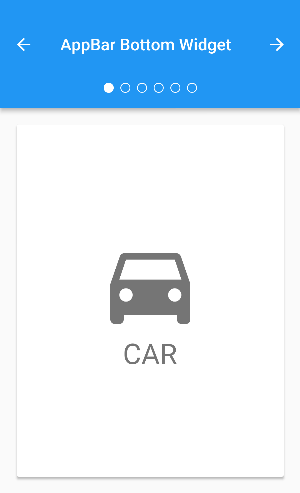

# 1. App结构和导航

## 1. Scaffold 组件

> [点击查看详细内容](../../ji-chu-zu-jian/ji-chu-zu-jian.md#8-scaffold-zu-jian)

## 2. AppBar 组件

> [点击查看详细内容](../../ji-chu-zu-jian/ji-chu-zu-jian.md#9-appbar-zu-jian)

## 3. BottomNavigationBar 组件

_**说明**_：底部导航条，可以很容易地在 `tap` 之间切换和浏览顶级视图。

_**介绍**_：`BottomNavigationBar` 由多个部分组成，这些部分以 `文本标签`、`图标` 或 `两者相结合` 的形式所展现。：`BottomNavigationBar` 可以对路由进行切换。对于较大的屏幕，侧边导航菜单可能更合适。

_**属性**_：

```dart
const BottomNavigationBar({
  // 类似 react 组件中的 key
  Key key; 
  // 定义 BottomNavigationBar 的每一项
  List<BottomNavigationBarItem> items; 
  // 点击事件触发的回调函数
  void Function(int) onTap; 
  // 当前选中的 BottomNavigationBar 的索引
  int currentIndex = 0; 
  // 此 BottomNavigationBar 的 z 坐标。
  double elevation = 8.0; 
  // 定义 BottomNavigationBar 的布局和行为。
  BottomNavigationBarType type;  
  // selectedItemColor 的值。
  Color fixedColor; 
  // BottomNavigationBar 背景的颜色。
  Color backgroundColor; 
  // icon 图标的尺寸大小
  double iconSize = 24.0; 
  // 当前选中的 BottomNavigationBar 的颜色
  Color selectedItemColor;   
  // 当前未选中的 BottomNavigationBar 的颜色
  Color unselectedItemColor; 
  // 当前选定的 BottomNavigationBarItem.icon 中图标的大小，不透明度和颜色 。如果未提供，大小将默认为 iconSize，颜色将默认为 selectedItemColor。
  IconThemeData selectedIconTheme = const IconThemeData();
  // 当前未选定的 BottomNavigationBarItem.icon 中图标的大小，不透明度和颜色 。如果未提供，大小将默认为 iconSize，颜色将默认为 selectedItemColor。
  IconThemeData unselectedIconTheme = const IconThemeData();
  // 当前选中的 BottomNavigationBarItem 标签时的字体大小。
  double selectedFontSize = 14.0;
  // 当前未选中的 BottomNavigationBarItem 标签时的字体大小。
  double unselectedFontSize = 12.0;
  // 当前选中的 BottomNavigationBarItem 的文字样式
  TextStyle selectedLabelStyle;
  // 当前未选中的 BottomNavigationBarItem 的文字样式
  TextStyle unselectedLabelStyle;
  // 是否显示未选择的 BottomNavigationBarItem 的标签文本。
  bool showSelectedLabels = true;
  // 是否显示已选择的 BottomNavigationBarItem 的标签文本。
  bool showUnselectedLabels;
})
```

_**例子**_：

```dart
/// 本例显示了在 Scaffold 组件中使用 BottomNavigationBar。BottomNavigationBar 有三个 BottomNavigationBarItem 组件，currentIndex 被设置为索引0。所选项目是 amber。_onitemtap 函数更改所选项的索引，并在 Scaffold 组件的中心显示相应的消息。
int _selectedIndex = 0;
static const TextStyle optionStyle = TextStyle(fontSize: 30, fontWeight: FontWeight.bold);
static const List<Widget> _widgetOptions = <Widget>[
  Text(
    'Index 0: Home',
    style: optionStyle,
  ),
  Text(
     'Index 1: Business',
     style: optionStyle,
  ),
  Text(
     'Index 2: School',
     style: optionStyle,
  ),
];

void _onItemTapped(int index) {
  setState(() {
    _selectedIndex = index;
  });
}

@override
Widget build(BuildContext context) {
  return Scaffold(
    appBar: AppBar(
      title: const Text('BottomNavigationBar Sample'),
    ),
    body: Center(
      child: _widgetOptions.elementAt(_selectedIndex),
    ),
    bottomNavigationBar: BottomNavigationBar(
      items: const <BottomNavigationBarItem>[
        BottomNavigationBarItem(
          icon: Icon(Icons.home),
          title: Text('Home'),
        ),
        BottomNavigationBarItem(
          icon: Icon(Icons.business),
          title: Text('Business'),
        ),
        BottomNavigationBarItem(
          icon: Icon(Icons.school),
          title: Text('School'),
        ),
      ],
      currentIndex: _selectedIndex,
      selectedItemColor: Colors.amber[800],
      onTap: _onItemTapped,
    ),
  );
}
```

## 4. TabBar 组件

_**说明**_：一个显示水平选项卡的 `Material Design widget`。

_**介绍**_：通常创建为 `AppBar` 的 `AppBar.bottom` 部分，并与 `TabBarView` 一起创建。如果未提供 `TabController`，则必须提供`DefaultTabController`。选项卡控制器的 `TabController.length` 必须等于 `选项卡列表的长度` 和 `TabBarView.children列表的长度` 。

_**属性**_：

```dart
const TabBar({
  // 类似于 react 组件中的 key
  Key key; 
  // 显示的标签内容，一般使用 Tab 组件,也可以是其他的 组件
  List<Widget> tabs;
  // 此 Widget 的选择和动画状态。如果未提供 TabController，则将使用 DefaultTabController.of 的值。
  TabController controller; 
  // 此选项卡栏是否可水平滚动
  bool isScrollable = false; 
  // 指示器颜色，所选标签下方显示的线条颜色。
  Color indicatorColor; 
  // 指示器高度，所选标签下方显示的线条高度。
  double indicatorWeight = 2.0; 
  // 底部指示器的 padding，所选标签下方显示的线条的 padding。
  EdgeInsetsGeometry indicatorPadding = EdgeInsets.zero; 
  // 指示器，例如边框等
  Decoration indicator; 
  // 指示器大小计算方式，TabBarIndicatorSize.label 跟文字等宽,TabBarIndicatorSize.tab 跟每个tab等宽
  TabBarIndicatorSize indicatorSize; 
  // 选中标签的颜色
  Color labelColor; 
  // 选中标签的样式
  TextStyle labelStyle; 
  // 每个标签的 padding 值
  EdgeInsetsGeometry labelPadding;
  // 未选中的标签的颜色 
  Color unselectedLabelColor; 
  // 未选中的标签的样式
  TextStyle unselectedLabelStyle; 
  // tab页面切换的方式
  DragStartBehavior dragStartBehavior = DragStartBehavior.start; 
  // 点击事件的回调函数
  void Function(int) onTap;
})
```

_**例子**_：


```dart
/// 该例展示了可切换的 TabBar 组件

import 'package:flutter/material.dart';

class TabbedAppBarSample extends StatelessWidget {
  @override
  Widget build(BuildContext context) {
    return new MaterialApp(
      home: new DefaultTabController(
        length: choices.length,
        child: new Scaffold(
          appBar: new AppBar(
            title: const Text('Tabbed AppBar'),
            bottom: new TabBar(
              isScrollable: true,
              tabs: choices.map((Choice choice) {
                return new Tab(
                  text: choice.title,
                  icon: new Icon(choice.icon),
                );
              }).toList(),
            ),
          ),
          body: new TabBarView(
            children: choices.map((Choice choice) {
              return new Padding(
                padding: const EdgeInsets.all(16.0),
                child: new ChoiceCard(choice: choice),
              );
            }).toList(),
          ),
        ),
      ),
    );
  }
}

class Choice {
  const Choice({ this.title, this.icon });
  final String title;
  final IconData icon;
}

const List<Choice> choices = const <Choice>[
  const Choice(title: 'CAR', icon: Icons.directions_car),
  const Choice(title: 'BICYCLE', icon: Icons.directions_bike),
  const Choice(title: 'BOAT', icon: Icons.directions_boat),
  const Choice(title: 'BUS', icon: Icons.directions_bus),
  const Choice(title: 'TRAIN', icon: Icons.directions_railway),
  const Choice(title: 'WALK', icon: Icons.directions_walk),
];

class ChoiceCard extends StatelessWidget {
  const ChoiceCard({ Key key, this.choice }) : super(key: key);

  final Choice choice;

  @override
  Widget build(BuildContext context) {
    final TextStyle textStyle = Theme.of(context).textTheme.display1;
    return new Card(
      color: Colors.white,
      child: new Center(
        child: new Column(
          mainAxisSize: MainAxisSize.min,
          crossAxisAlignment: CrossAxisAlignment.center,
          children: <Widget>[
            new Icon(choice.icon, size: 128.0, color: textStyle.color),
            new Text(choice.title, style: textStyle),
          ],
        ),
      ),
    );
  }
}

void main() {
  runApp(new TabbedAppBarSample());
}
```

## 5. TabBarView 组件

_**说明**_：显示与当前选中的选项卡相对应的页面视图。通常和 `TabBar` 一起使用。

_**介绍**_：如果未提供 `TabController`，则必须有一个 `DefaultTabController`。选项卡控制器的 `TabController.length` 必须等于 `子代列表的长度` 和 `TabBar.tabs列表的长度`。

_**属性**_：

```dart
const TabBarView({
  Key key; // 类似于 react 组件中的 key
  List<Widget> children; // 子组件
  TabController controller; // 此 Widget 的选择和动画状态。
  ScrollPhysics physics; // 页面视图应如何响应用户输入。例如，确定用户停止拖动页面视图后页面视图如何继续进行动画处理。
  DragStartBehavior dragStartBehavior = DragStartBehavior.start; // tab页面切换的方式
})
```

_**例子**_：



```dart
/// TabBarView 的相关使用

import 'package:flutter/material.dart';

class AppBarBottomSample extends StatefulWidget {
  @override
  _AppBarBottomSampleState createState() => new _AppBarBottomSampleState();
}

class _AppBarBottomSampleState extends State<AppBarBottomSample> with SingleTickerProviderStateMixin {
  TabController _tabController;

  @override
  void initState() {
    super.initState();
    _tabController = new TabController(vsync: this, length: choices.length);
  }

  @override
  void dispose() {
    _tabController.dispose();
    super.dispose();
  }

  void _nextPage(int delta) {
    final int newIndex = _tabController.index + delta;
    if (newIndex < 0 || newIndex >= _tabController.length)
      return;
    _tabController.animateTo(newIndex);
  }

  @override
  Widget build(BuildContext context) {
    return new MaterialApp(
      home: new Scaffold(
        appBar: new AppBar(
          title: const Text('AppBar Bottom Widget'),
          leading: new IconButton(
            tooltip: 'Previous choice',
            icon: const Icon(Icons.arrow_back),
            onPressed: () { _nextPage(-1); },
          ),
          actions: <Widget>[
            new IconButton(
              icon: const Icon(Icons.arrow_forward),
              tooltip: 'Next choice',
              onPressed: () { _nextPage(1); },
            ),
          ],
          bottom: new PreferredSize(
            preferredSize: const Size.fromHeight(48.0),
            child: new Theme(
              data: Theme.of(context).copyWith(accentColor: Colors.white),
              child: new Container(
                height: 48.0,
                alignment: Alignment.center,
                child: new TabPageSelector(controller: _tabController),
              ),
            ),
          ),
        ),
        body: new TabBarView(
          controller: _tabController,
          children: choices.map((Choice choice) {
            return new Padding(
              padding: const EdgeInsets.all(16.0),
              child: new ChoiceCard(choice: choice),
            );
          }).toList(),
        ),
      ),
    );
  }
}

class Choice {
  const Choice({ this.title, this.icon });
  final String title;
  final IconData icon;
}

const List<Choice> choices = const <Choice>[
  const Choice(title: 'CAR', icon: Icons.directions_car),
  const Choice(title: 'BICYCLE', icon: Icons.directions_bike),
  const Choice(title: 'BOAT', icon: Icons.directions_boat),
  const Choice(title: 'BUS', icon: Icons.directions_bus),
  const Choice(title: 'TRAIN', icon: Icons.directions_railway),
  const Choice(title: 'WALK', icon: Icons.directions_walk),
];

class ChoiceCard extends StatelessWidget {
  const ChoiceCard({ Key key, this.choice }) : super(key: key);

  final Choice choice;

  @override
  Widget build(BuildContext context) {
    final TextStyle textStyle = Theme.of(context).textTheme.display1;
    return new Card(
      color: Colors.white,
      child: new Center(
        child: new Column(
          mainAxisSize: MainAxisSize.min,
          crossAxisAlignment: CrossAxisAlignment.center,
          children: <Widget>[
            new Icon(choice.icon, size: 128.0, color: textStyle.color),
            new Text(choice.title, style: textStyle),
          ],
        ),
      ),
    );
  }
}

void main() {
  runApp(new AppBarBottomSample());
}
```

## 6. MaterialApp 组件

_**说明**_：`MaterialApp` 代表使用纸墨设计（`Material Design`）风格的应用。里面包含了纸墨设计风格应用所需要的基本控件。

_**介绍**_：如果创建了 `Navigator`，则这些选项中的至少一个必须处理该/路由，因为在启动时指定了无效的 `initialRoute` 时将使用该路由（例如，另一个应用程序意图在 `Android` 上启动该路由；此组件还配置顶级 `Navigator`（如果有）的观察者以执行 `Hero动画`。如果 `home`，`route`，`onGenerateRoute和onUnknownRoute` 均为空，而 `builder` 不为空，则不会创建任何导航器。

_**属性**_：

```dart
const MaterialApp({
  // 类似 react 组件中的 key
  Key key;
  // 在构建导航器时使用的键。
  GlobalKey<NavigatorState> navigatorKey;
  // 应用程序默认路由的组件,用来定义当前应用打开的时候，所显示的界面
  Widget home;
  // 应用程序的顶级路由表
  Map<String, Widget Function(BuildContext)> routes = const <String, WidgetBuilder>{}; 
  // 如果构建了导航器，则显示的第一个路由的名称
  String initialRoute; 
  // 应用程序导航到指定路由时使用的路由生成器回调
  Route<dynamic> Function(RouteSettings) onGenerateRoute; 
  // 当 onGenerateRoute 无法生成路由(initialRoute除外)时调用
  Route<dynamic> Function(RouteSettings) onUnknownRoute; 
  // 为该应用程序创建的导航器的观察者列表
  List<NavigatorObserver> navigatorObservers = const <NavigatorObserver>[]; 
  // 用于在导航器上面插入组件，但在由 WidgetsApp组件 创建的其他组件下面插入组件，或用于完全替换导航器
  Widget Function(BuildContext, Widget) builder;
  // 设备用于为用户识别应用程序的单行描述
  String title = '';
  // 如果非空，则调用此回调函数来生成应用程序的标题字符串，否则使用标题。
  String Function(BuildContext) onGenerateTitle;
  // 在操作系统界面中应用程序使用的主色。
  Color color;
  // 应用程序组件使用的颜色。
  ThemeData theme;
  // 系统请求 “暗模式” 时使用的主题。
  ThemeData darkTheme;
  // 如果同时提供了 theme 和 darkTheme，则确定应用程序将使用哪个主题。如果设置为 ThemeMode.system，则根据系统便好设置使用主题
  ThemeMode themeMode = ThemeMode.system;
  // 此应用程序本地化组件的初始区域设置基于此值。
  Locale locale;
  // 这个应用程序本地化组件的委托。
  Iterable<LocalizationsDelegate<dynamic>> localizationsDelegates;
  // 这个回调负责在应用程序启动时以及用户更改设备的区域设置时选择应用程序的区域设置。
  Locale Function(List<Locale>, Iterable<Locale>) localeListResolutionCallback;
  // 这个回调将传递到此组件构建的 WidgetsApp。
  Locale Function(Locale, Iterable<Locale>) localeResolutionCallback;
  // 此应用程序已本地化的地区列表
  Iterable<Locale> supportedLocales = const <Locale>[Locale('en', 'US')];
  // 打开绘制基线网格材质应用程序的网格纸覆盖
  bool debugShowMaterialGrid = false;
  // 打开性能叠加
  bool showPerformanceOverlay = false;
  // 打开栅格缓存图像的棋盘格
  bool checkerboardRasterCacheImages = false; 
  // 打开渲染到屏幕外位图的图层的棋盘格
  bool checkerboardOffscreenLayers = false;
  // 打开显示框架报告的可访问性信息的覆盖
  bool showSemanticsDebugger = false;
  // 在选中模式下打开一个小的“DEBUG”横幅，表示应用程序处于选中模式
  bool debugShowCheckedModeBanner = true;
})
```

_**例子**_：

```dart
/// 本示例说明如何创建 MaterialApp，以使用启动应用程序时将显示的本地路由禁用“调试”横幅。
MaterialApp(
  home: Scaffold(
    appBar: AppBar(
      title: const Text('Home'),
    ),
  ),
  debugShowCheckedModeBanner: false,
)

/// 此示例说明如何创建使用路线定义 `起始路由` 和 `about路由` 的 `MaterialApp`。 
MaterialApp(
  routes: <String, WidgetBuilder>{
    '/': (BuildContext context) {
      return Scaffold(
        appBar: AppBar(
          title: const Text('Home Route'),
        ),
      );
    },
    '/about': (BuildContext context) {
      return Scaffold(
        appBar: AppBar(
          title: const Text('About Route'),
        ),
      );
     }
   },
)

/// 本示例说明如何创建 `MaterialApp`，还有设置主题。
MaterialApp(
  theme: ThemeData(
    brightness: Brightness.dark,
    primaryColor: Colors.blueGrey
  ),
  home: Scaffold(
    appBar: AppBar(
      title: const Text('MaterialApp Theme'),
    ),
  ),
)
```

## 7. WidgetsApp 组件

_**说明**_：一个方便的类，它封装了应用程序通常需要的一些 `widget`。

_**介绍**_：`WidgetsApp` 提供的主要功能之一是绑定 `system back` 按钮以弹出 `Navigator` 或退出应用程序。

_**属性**_：

```dart
const WidgetsApp({
    // 类似于 react 组件中的 key
    Key key;
    // 创建导航器的时候使用的键
    GlobalKey<NavigatorState> navigatorKey;
    // 当应用程序导航到指定路由时使用的路由生成器回调。
    Route<dynamic> Function(RouteSettings) onGenerateRoute;
    // 用来描述例如 404 的未找到的路由
    Route<dynamic> Function(RouteSettings) onUnknownRoute;
    // 为该应用程序创建的导航器的观察者列表。
    List<NavigatorObserver> navigatorObservers = const <NavigatorObserver>[];
    // 初始路由，默认路由
    String initialRoute;
    // 当应用程序导航到指定路由时使用的 PageRoute 生成器回调。例如，可以使用这个回调函数来指定应该使用 MaterialPageRoute 或 CupertinoPageRoute 来构建页面转换。
    PageRoute<T> Function<T>(RouteSettings, Widget Function(BuildContext)) pageRouteBuilder;
    // 应用程序默认路由的小部件( Navigator.defaultRouteName，即 /)。这是在应用程序正常启动时首先显示的路由，除非指定了initialRoute。如果不能显示initialRoute，它也是显示的路由。
    Widget home;
    Map<String, Widget Function(BuildContext)> routes = const <String, WidgetBuilder>{};
    Widget Function(BuildContext, Widget) builder;
    String title = '';
    String Function(BuildContext) onGenerateTitle;
    TextStyle textStyle;
    Color color;
    Locale locale;
    Iterable<LocalizationsDelegate<dynamic>> localizationsDelegates;
    Locale Function(List<Locale>, Iterable<Locale>) localeListResolutionCallback;
    Locale Function(Locale, Iterable<Locale>) localeResolutionCallback;
    Iterable<Locale> supportedLocales = const <Locale>[Locale('en', 'US')];
    bool showPerformanceOverlay = false;
    bool checkerboardRasterCacheImages = false;
    bool checkerboardOffscreenLayers = false;
    bool showSemanticsDebugger = false;
    bool debugShowWidgetInspector = false;
    bool debugShowCheckedModeBanner = true;
    Widget Function(BuildContext;
    void Function()) inspectorSelectButtonBuilder};
})
```

_**例子**_：

## 8. Drawer 组件

_**说明**_：

_**介绍**_：

_**属性**_：

_**例子**_：

